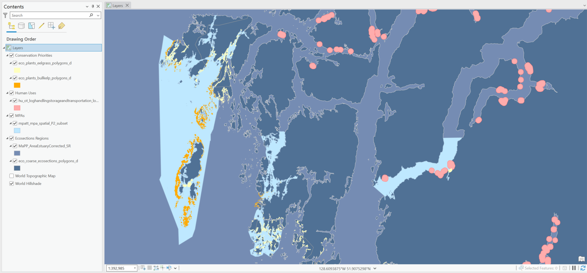
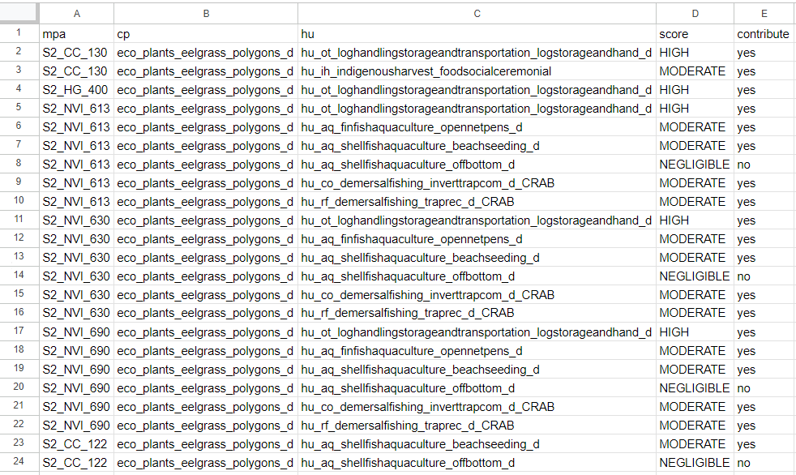
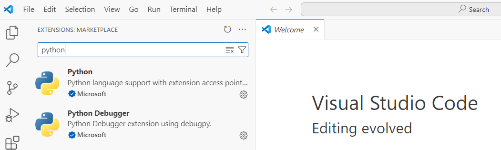
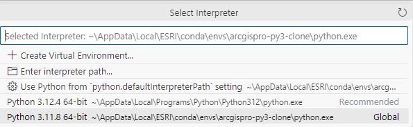

# Conservation Gaps Analysis Tool
> The CGA tool calculates the protection provided to ecological conservation features in the Northern Shelf Bioregion and provides the option to consider the impact of human activities. 

The Conservation Gaps Analysis (CGA) tool provides the ability to assess and compare protection provided by Marine Protected Areas (MPAs) to ecological features, called ecological conservation priorities (CPs or E-CPs). The CGA script analyzes features within the Northern Shelf Bioregion (NSB). This region contains over 100 MPA sites that are not considered to be "fully protected" since they allow for various human activities. The script provides the ability to assess the degree of protection provided by these sites, and also to evaluate the interactions between CPs and human use activities (HU) that may occur within an MPA.

For more details on the tool's background and methodology, please refer to the "Conservation Gap Analysis" overview document.

# Table of Contents

- [Terminology](#terminology)
- [Script Summary](#script-summary)
    - [Overview](#overview)
    - [Script Flow](#script-flow)
- [Installation](#installation)
    - [ArcGIS Pro](#arcgis-pro)
    - [Pro 3 vs 2](#pro-3-vs-2)
    - [Python run options](#python-run-options)
- [Quick Start](#quick-start)
    - [Folder Structure](#folder-structure)
    - [Instructions](#instructions)
- [Tracking a Run](#tracking-a-run)
    - [Tracking Instructions](#tracking-instructions)
- [Code Details](#code-details)
    - [Typical Script Flow](#typical-script-flow)
    - [Variations](#variations)
- [2024 Updates](#2024-updates)
- [Logging](#logging)
    - [Configuration](#configuration)
    - [Customization](#customization)
- [Troubleshooting](#troubleshooting)
    - [Tips for Success](#tips-for-success)
    - [Errors](#errors)

<br>

# Terminology
[(Back to top)](#table-of-contents)

The following table lists concepts, datasets, or inputs that play a key role in the CGA script. 

| Term | Definition |
| --- | ----------- |
| Marine Protected Area (MPA) | A part of the ocean legally protected under the _Oceans Act_ in order to conserve marine species and populations. |
| Ecological Conservation Priorities (CPs/E-CPs) | Ecological features that are prioritized in MPA network planning (can include species groups, habitats, or areas). |
| Human Uses (HUs) | Human activities that may or may not impact ecological features. |
| Assessment matrix | A list of which human activities are permitted/restricted in an MPA based on network planning. |
| Interaction matrix | A table listing possible interactions between ecological features and human features, as well as consequence ratings characterizing the impact of these interactions (negative or neutral). |
| CP Overlap table | A CSV file that contains the total area of each CP that falls within each subregion/ecosection.|
| MPATT eco UID table | A CSV file that contains information about each CP (eco feature) along with additional data. These fields are joined to the first output table produced by the script.|

## Alternative terms:

Some terms were referred to differently in the past, and some of these older references persist in the script or related documentation:

| Term | Definition |
| --- | ----------- |
| Inclusion matrix | An older term for the assessment matrix. This term is used as the main reference for the assessment matrix in the script. |
| Eco features | Conservation priorities (CPs/E-CPs).|


<br>

# Script Summary
[(Back to top)](#table-of-contents)

_For a detailed breakdown of the code, please see the [Code details](#code-details) section._

## Overview

The script assesses the degree of protection given to ecological conservation priorities (CPs) while taking into account interactions with human activities. The screenshot below shows the spatial distribution of a sampling of these features in a given area. This example is taken from the Quick Start APRX file (CGA_QuickStart.aprx), which provides the ability to run the CGA script against a small subset of features. (For instructions on how to run the script with the Quick Start data, see the [Quick Start](#quick-start) section.)

Some CP features (such as eelgrass and bull kelp, in yellow and orange below) overlap or are entirely contained within MPA zones (light blue). Certain MPA zones also include both CPs and human use activities (HUs, in pink). As part of the CGA analysis, the script examines the spatial relationships between these features and evaluates interactions between CP and HU features within MPA zones.



<br>

The script produces a number of tabular outputs that list the results of the CGA analysis. Details from the output tables include the CP areas that are present within each MPA zone, the ecosections or subregions that CPs fall within, and the CP-HU interactions that occur within each MPA along with a rating of their severity ("HIGH", "MODERATE", and "NEGLIGIBLE" negative interactions).

Below is an example of one of the output tables (Table #4), which shows CP-HU interactions occurring within the MPAs:




## Script Flow

The script completes the following:
* Loads and prepares input datasets for analysis. These include:
    * Geospatial data layers (CPs, HUs, MPAs, ecosections, and subregions)
    * Tabular inputs (assessment matrix, CP overlap dictionary, interaction matrix)
* Determines the total amount of each CP layer that falls within each ecosection or subregion.
* Calculates the total amount of each CP and HU layer that exists in each MPA zone. Returns various statistics on the layers' presence in MPAs (area/percentage calculations).
* Consults the assessment (inclusion) matrix to find all relevant HU activities in MPA zones.
* Identifies all interactions between CPs and HU activities and determines their severity.
* Writes 5 output tables with the results of the analysis:
    * Table 1: Lists the amount of each CP in each MPA zone, divided by ecosection/subregion where features overlap zones.
    * Table 1 joined: Table 1 data joined with additional fields from the MPATT eco UID table.
    * Table 2: Lists CPs by ecosection/subregion, including their proportion, original areas, and protected areas.
    * Table 3: Lists the percentage of areal overlap between the CP or HU layer and the MPA layer (sliver threshold table).
    * Table 4: Lists the CP and HU interactions by MPA.

<br>

# Installation
[(Back to top)](#table-of-contents)

## ArcGIS Pro
Running the CGA script requires a local installation of ArcGIS Pro, which will also install Python 3. 

### Install ArcGIS Pro

If ArcGIS Pro is not yet installed on your machine, work with your organization to download and install the software. 
* ArcGIS Pro can be downloaded either from My Esri or your ArcGIS Online organization. For download details, see [Download ArcGIS Pro](https://pro.arcgis.com/en/pro-app/latest/get-started/download-arcgis-pro.htm).
* Once the ArcGIS Pro has been downloaded, you will need to sign in to use it. If you're using Pro as part of an organization, your administrator will usually need to go into the organization's ArcGIS Online account to configure your access to Pro. See [Manage ArcGIS Pro license in ArcGIS Online](https://pro.arcgis.com/en/pro-app/latest/get-started/assign-named-user-licenses-in-arcgis-online.htm) for more information.
* If you are working independently of an organization, there are different options for purchasing ESRI product licenses. See the [ESRI Canada product overview page](https://www.esri.ca/en-ca/store/overview) for details.


### Optional: Clone Python conda environment

Once ArcGIS Pro has been installed, Python 3 will also be available on your machine. This Python installation bundles together a large collection of Python packages, which include a variety of useful libraries like `pandas` and `scipy`. These packages are supported by a package management system called conda. 

With the default installation, ArcGIS Pro has a single conda environment. If you wish to further customize your conda environment by installing additional Python libraries or changing any configurations, ESRI recommends cloning the default conda environment. 

For detailed instructions on cloning and activating a new conda environment, see [Clone an environment](https://pro.arcgis.com/en/pro-app/latest/arcpy/get-started/clone-an-environment.htm).


## Pro 3 vs 2
The CGA script is designed to run in an ArcGIS Pro 3.x environment. The script has been successfully tested in an older Pro environment (2.9), but requires creating brand-new APRX documents in your older version of ArcGIS Pro. (You will not be able to use the prepackaged `CGA_QuickStart.aprx` file.)

To prepare the script to run in ArcGIS Pro 2.x:
* Open your version of Pro 2.x and create a brand new blank map project. Save it to a new folder within the root CGA folder (e.g., aprx_pro_v2).
* Rename the map frame name from "Map" to "Layers" (this will align with the script's expectations).
* Add each spatial layer to the map frame, referencing the spatial data stored in the /spatial folder:
    * CP layers: Add from spatial/mpatt_eco_cp.gdb
    * HU layers: Add from spatial/hu.gdb
    * MPA layer: Add from spatial/mpatt_mpa.gdb
    * Regional layers: Add from spatial/mpatt_rgn.gdb
* The default `CGA_QuickStart.aprx` project file (created in Pro 3.3) collects layers into groups (for example, the "Conservation Priorities" group holds all CP layers). In your 2.x project, you may wish leave all layers ungrouped when first testing, and then try grouping later in case ArcGIS Pro 2.x handles layer names in groups differently than 3.3.
* Once the project has been saved, open the CGA script file and update the dir_aprx with your new APRX file.
* Try running the script with reference to your new APRX file.

## Python run options

ArcGIS Pro supports a number of ways to run Python scripts. Here are a few ways that a large Python files like the CGA script can be run:
* Run from the [command prompt](https://pro.arcgis.com/en/pro-app/latest/arcpy/get-started/installing-python-for-arcgis-pro.htm#ESRI_SECTION1_CD96A9B97F874266A6F6CDBF6FE5FEDA)
* Run from an [integrated development environment (IDE)](https://pro.arcgis.com/en/pro-app/latest/arcpy/get-started/installing-python-for-arcgis-pro.htm#ESRI_SECTION1_3AEA2C9993704EDE826599AE78BB8CCB)
    * The default Python IDE (IDLE) is available as part of the ArcGIS Pro and can usually be launched from your Windows start menu or through the command line.
    * Alternatively, you can configure another IDE such as Visual Studio Code (instructions below) or PyCharm should you wish to run your code with access to more code editing features. 

### Configuring VS Code to run the script
These instructions provide a guide to configuring VS Code as an IDE that can run Python scripts with ArcGIS Pro.
* Download [Visual Studio Code](https://visualstudio.microsoft.com/downloads/)
* From the extensions menu, install the "Python" extension (published by Microsoft) to give VS Code Python language support.
    * Another useful extension is the "Python Debugger".

    

<br>

* Change your Python interpreter to point to the ArcGIS Pro Python installation location (where the python.exe file is stored):
    * Right-click anywhere in your code and choose Command Palette. Alternatively, type ">" in the search bar to pull up Command Palette options.
    * In the search bar, type "interpreter" and select "Python: Select Interpreter".
    * Paste the path to the Python interpreter, or browse using File Explorer.
        * The default Python interpreter location is usually in your AppData folder (e.g., ~\AppData\Local\Programs\Python312\python.exe)
        * If you cloned your conda environment, it may be in a separate ESRI folder within AppData\Local (e.g., ~\AppData\Local\ESRI\conda\envs\arcgispro-py3-clone\python.exe)

    

<br>

# Quick Start
[(Back to top)](#table-of-contents)

A sample dataset and APRX project has been provided to allow users to run the script right away without needing to prepare their own datasets. 


## Folder Structure

The following folder structure houses the sample files:
* aprx: Contains the APRX project file that contains all the spatial layers. The script will read the spatial layers from this map file.
    * CGA_QuickStart.aprx: APRX sample project file
* input: Contains the tabular input data:
    * cpOverlap_rev.csv
    * interactionmatrix_20210531.csv
    * mpatt_eco_UID-simple_20210601.csv
    * MPATT_Spatial_P3_CGAAssess_20220616.csv
* logging: Folder where the logging functionality is configured and logs are produced. For more information, see the [Logging](#logging) section.
    * logging.conf: The logging configuration file.
    * cga_script.log: The external log file that captures status messages and debugging logs.
* output: Folder where the output tables will be written.
* spatial: Contains the source of the spatial data layers, contained in file geodatabases:
    * hu.gdb: Human use geodatabase containing a sample layer (log handling and storage)
    * mpatt_eco_cp.gdb: Conservation priorities (CP) geodatabase with 2 sample layers (bull kelp and eelgrass polygons)
    * mpatt_mpa.gdb: MPA geodatabase containing the MPA layer (P2)
    * mpatt_rgn.gdb: Regional geodatabase containing ecosections (eco_coarse_ecosections_polygons_d) and subregions (MaPP_AreaEstuaryCorrected_SR)

```sh
├── aprx
│   ├── CGA_QuickStart.aprx
├── input
│   ├── cpOverlap_rev.csv
│   ├── interactionmatrix_20210531.csv
│   ├── mpatt_eco_UID-simple_20210601.csv
│   ├── MPATT_Spatial_P3_CGAAssess_20220616.csv
├── logging
│   ├── logging.conf
├── output
├── spatial
│   ├── hu.gdb
│   │   ├── hu_ot_loghandlingstorageandtransportation_logstorageandhand_d
│   ├── mpatt_eco_cp.gdb
│   │   ├── eco_plants_bullkelp_polygons_d
│   │   ├── eco_plants_eelgrass_polygons_d
│   ├── mpatt_mpa.gdb
│   │   ├── mpatt_mpa_spatial_P2_subset
│   ├── mpatt_rgn.gdb
│   │   ├── eco_coarse_ecosections_polygons_d
│   │   ├── MaPP_AreaEstuaryCorrected_SR
│   ├── working_TEMP
```

## Instructions 

* Open the script in an IDE or text editor. 

* By default, the script will detect your working directory and already has references to all the Quick Start datasets within the "DIRECTORY CONFIGURATIONS". This should allow you to run the script with the Quick Start data without making any modifications to the main script file. 
    * When running the script with different datasets, review the "DIRECTORY CONFIGURATIONS" section and update the directory paths to point to the new input/output files and folders.
    * It's unlikely that you will need to change any logging configurations, but if you find that the script is unable to write the log file to the "logging" folder, please read "Note on the logging configuration" below for instructions on how to modify the logging configuration.
* You can also choose to modify the configurable variables in the script. Familiarize yourself with the "CONFIGURABLE VARIABLES" section to understand what configurations can be adjusted. 
* In your IDE (or with the command prompt), run the script. ArcGIS Pro does not need to be open to run the script successfully.
* The script will produce a log file with various messages and will print status messages to the Python standard output by default. 
* Once the script is finished, navigate to the /output folder to view the output files.

### Note on the logging configuration

The logging configuration file (logging.conf) controls how the log messages are written and saved. This file contains a relative directory reference to the "logging" folder in the CGA Project root directory. This directory reference tells the script where to write the external logging file (cga_script.log). In most cases, the default relative directory reference will work without modification. However, if the script is having trouble detecting the location of the logging folder, you can replace the relative directory reference with an absolute path by following the steps below:  
* Find the logging configuration file (logging > logging.conf).
* Locate the `[handler_fileHandler]` header and its `args` property:
    ```sh
    args=(r'logging\cga_script.log', 'w')
    ```
* Update `r'logging\cga_script.log'` with the full path to the logging folder where it is located on your machine (e.g., `r'C:\Users\MyUserName\Documents\CGA_Project\logging\cga_script.log'`).
* Once the root directory reference is recognized, the script will write a log file called cga_script.log to the logging folder. If a log file with the same name already exists, the script will overwrite the file.

<br>

# Tracking a Run
[(Back to top)](#table-of-contents)

It is advisable to track official runs of the script in the provided run tracking spreadsheet. This keeps a record of how the script has been used over time with different datasets and configurations. 

The tracking spreadsheet "CGA_Run_Tracking.xlsx" is contained within the dedicated "_RunTracking/Tracking_PastRuns" folder. This allows users to capture the details of the run and archive the tabular input/output datasets (the spatial datasets should generally be excluded due to their large size).

## Tracking Instructions

For specific instructions, please review the README_run_tracking.md file within the "_RunTracking" folder.

<br>

# Code Details
[(Back to top)](#table-of-contents)

This section provides a detailed breakdown of the script flow. This summary can be used to help interpret the program flow at the starting point of the script's execution (search "PROGRAM START" to find the official starting point).

## Typical Script Flow

### Create workspace and load regional data (ecosections & subregions)
* Create a temporary geodatabase and set it as the workspace.
* Load and prepare regional layers (ecosections and subregions):
    * Find layers in the APRX file.
    * Load into workspace and reproject to the Albers projection.
    * Calculate area fields, remove unnecessary fields, and handle complex features.

### Load and prepare MPA layers
* Define a number of variables (names and attributes) required to prepare the MPA layers.
* Create a dictionary (`mpa_dict`) to store MPA attributes. This is used as a lookup reference.
* Prepare the MPA layer(s) to include additional data needed for the analysis:
    * Find MPA layers in the APRX file.
    * Load into workspace and reproject to the Albers projection.
    * Set up field mappings.
    * Consolidate all MPA names into one field.
    * Intersect MPAs with subregions and calculates MPA areas.
    * Intersect MPAs with ecosections. 
    * Dissolve (aggregates) MPAs by MPA and ecosections.

### Load non-spatial (tabular) data into dictionaries
* Load CP area overlap data.
    * If the variable `cpOverlap_newDict` is False, the script will populate the CP area overlap dictionary with data from the CP overlap CSV file (generated from a previous run).
    * If `cpOverlap_newDict` is True, the script will build the dictionary entirely from scratch later in the script, relying on new spatial analyses to determine the overlaps.
* Load layer presence threshold data from CSV if provided.
    * Here, the script provides the option to include an external layer presence threshold CSV file to provide custom threshold values. However, this is not a commonly-used configuration.
    * In most cases, the default CP/HU threshold values will be used later in the script and a layer presence threshold dictionary won't be populated.
* Load inclusion (assessment) matrix.

### Load CP/HU layers
* Create a layer list of CP/HU layers based on APRX dataset names.
* Define a number of variables (names and attributes) required during the analysis.

### Process CP/HU layers for presence in MPAs (main CGA analysis)
* Check for edge cases (complex layers, layers based on density/diversity).
* Prepare the CP/HU layers for processing:
    * Load working layer into workspace and reproject to the Albers projection.
    * Calculate area fields, remove unnecessary fields, and handle complex features.
* Determine layer presence threshold values:
    * Set threshold to default HU/CP presence threshold.
    * If the threshold dictionary was populated (with data from CSV from earlier step), overwrite threshold with values from the dictionary.
* Ensure all CP layers are represented in the CP overlap dict (represents area/value of CP layers in each ecosection/subregion).
* Calculate presence of CP/HU layers in MPAs:
    * Perform geometric operations on CP/HU layers to determine amount of each layer that falls within each MPA.
    * Returns layers updated with new fields containing area measurements and additional calculations.
    * Reads calculations into dictionaries storing statistics for the MPAs (`mpa_presence`) and sliver frequencies (`sliver_freq` - will be used to calculate percent overlap data).
* Populate dictionaries with CP/HU layer data:
    * `hu_in_mpas`: HU presence dictionary (the existence of an HU in an MPA)
    * `cp_in_mpas`: CP presence dictionary
    * `percent_overlap`: Sliver threshold dictionary

### Update objects with additional data
* Update the CP overlap CSV with current CP area overlap data.
    * This keeps the CSV file up-to-date with data from the cp_area_overlap_dict so that future script runs will use the latest data.
* Add HU data (from the inclusion matrix) to the HU presence dictionary (`hu_in_mpas`).
    * This adds dummy data for HUs that should be in each MPA according to the inclusion matrix but didn't have spatial data that sufficiently intersected.
* Clean up the temporary geodatabase (if `cleanUpTempData` is True).

### Find HU/CP interactions within MPAs
* Load the interaction matrix into a dictionary.
    * Read in the data and standardize the interaction severity:
        | Standardized value | Original values | 
        | --- | ----------- |
        | HIGH |'VERY HIGH' or  'Major Negative'|
        | MODERATE |'MEDIUM' or 'Minor Negative' |
        | NEGLIGIBLE |'Negligible' or 'NEGLIGIBLE' |
* Identify interactions between HUs and CPs:
    * For each MPA, compare the HU and CP presence dictionaries (`hu_in_mpas` and `cp_in_mpas`) to the interactions matrix to identify the interaction values.

### Prepare and write output tables
* Consolidate output data into dictionaries (`o_table_1`, `o_table_2`).
* Count number of interactions by severity (HIGH and MODERATE) which will be used to calculate the effectiveness score.
* Calculate effectiveness scores to scale the CP areas. These effectiveness scores are multiplied by the CP areas to assess the areal amount of a CP that can be considered 'protected'.
    |HU impact on CP| Condition | Resulting effectiveness score | 
    | --- | ----------- | ----------- | 
    | High negative impact |Number of high interactions > 0 or number of moderate interactions > 4| 0.0 |
    | Moderate-high negative impact |Number of moderate interactions = 4 | 0.24 |
    | Moderate negative impact |Number of moderate interactions = 3 | 0.6 |
    | Low negative impact |Number of moderate interactions > 0 and number of moderate interactions < 3| 0.85 |
    | Negligible negative impact |If conditions above not met| 1.0 |
* Scale CP areas by effectiveness scores (multiply 'unscaled' CP areas by scores)
* Write the 5 output tables.

## Variations

The script can be reconfigured to run slightly differently depending on a user's requirements. The "CONFIGURABLE VARIABLES" section provides the user with the ability to change certain default configurations and include additional files. 

Some variations include:
* **Override variables (`override_y` and `override_n`):** The two override variables define how to interpret the presence of an HU activity in an MPA when a code exists in the inclusion matrix (O, C, X, na). Depending on the configuration, the script can consider spatial overlap based on the spatial layers or rely solely on the inclusion matrix to determine the presence of HU activities. For more information, see the comments in the "CONFIGURABLE VARIABLES" section.

* **CP overlap variations:** The user can populate CP area overlap data from an external CSV file or choose to rebuild all spatial overlaps from scratch during the script run.

* **Layer presence threshold CSV file:** Although not commonly used, the script does provide the ability to supply a custom layer presence threshold file that specifies the threshold values for each CP/HU layer.

* **Script execution preferences:** Additional customizations can be made to the script run itself, such as choosing to print status messages to the standard output (`print_status`) or retaining temporary data stored in the temp geodatabase after the script has finished.

<br>

# 2024 Updates
[(Back to top)](#table-of-contents)

The following script updates were made in 2024:
* The code was converted from Python 2 to 3 and arcpy modules were updated to be compatible with ArcGIS Pro.
* Classic Overlay functions (Intersect and Dissolve) were replaced with Pairwise equivalents to speed up the overall script runtime.
* Defunct code and comments were removed:
    * Sections that facilitated an additional regional layer load. This functionality was originally designed to identify layers with subregional suffix in their layer name (to check for subregionally clipped layers).
    * Sections that applied a scaling attribute to area calculations (unrelated to effectiveness score calculations).
    * Instances of the deprecated `num_low` variable that had appeared in the countInteractions() and calcEffectivenessScore() functions.
    * References to the deprecated `override_u` variable. 
* Comments were revised and standardized.
* Logging functionality was implemented and debug messages added.
* Runtime calculations were added (to log the amount of time taken for geoprocessing operations).
* New directory functionality was added to detect the user's working directory and set relative paths to inputs/outputs.

<br>

# Logging
[(Back to top)](#table-of-contents)

The script has logging functionality that provides print statements to the Python standard output (stdout) as well as additional debugging messages that are written to a separate log file. The logging can be used as is or customized further to assist with testing and debugging. Below are details on the current configuration and guidance on how to customize the logging further.

## Configuration

The logging is controlled by a configuration file (/logging/logging.conf). This provides two distinct "loggers" (ways of writing messages):
* "multiLogger": This logger writes logs to both the standard output (simulating print statements) and to an external log file. This is intended for status messages that describe a significant milestone in the script's progression.
* "fileLogger": This logger writes logs only to the external log file. This is intended for detailed debugging messages that aren't necessary for a user to see, but can be useful for diagnosing an issue.

**Formatting:** These loggers also have custom formatting that adds timestamps and other details to the log messages:

```sh
# logging.conf

# Formatting for multiLogger messages:
[formatter_consoleFormatter]
format='%(asctime)s - %(message)s'

# Formatting for fileLogger messages:
[formatter_fileFormatter]
format='%(asctime)s - Line: %(lineno)4d - %(levelname)8s - Func: %(funcName)25s - %(message)s'
```

**Logging levels:** Each of these loggers is configured with a minimum logging level denoting the level of detail or severity of the message. (For more information on Python logging levels, see [logging — Logging facility for Python](https://docs.python.org/3/library/logging.html#logging-levels).)

* multiLogger - level=INFO: This is designed to capture messages that confirm the script is progressing as expected. INFO-level logs will capture any logs from the INFO level and higher.
* fileLogger - level=DEBUG: This is designed to capture more detailed information. DEBUG-level logs will capture any logs from the DEBUG level and higher (will include INFO-level logs).

Here are some examples of how the loggers are applied in the script:

```sh
# CGA script

# Initialize variables to refer to the two loggers:
logger_file = logging.getLogger('fileLogger')
logger_multi = logging.getLogger('multiLogger')
```

```sh
# Will print a message to the standard output and record in the external log file.
logger_multi.info('Starting script...')
```

```sh
# Will only record this message in the external log file.
logger_file.debug('Completed intersect (layer: mpas_merged). Runtime was %s seconds (%s min)', intersect_runtime_sec, intersect_runtime_min)
```

## Customization

Although the only variations in the current CGA script are logger_multi.info() and logger_file.debug(), additional messages could be added and further customized to suit testing or error handling. 

For example, although the fileLogger is configured to record messages at the DEBUG level at the minimum, this logger could be used to add INFO-level messages that may be helpful to capture in an external log, but are not necessary to display to the user in the standard output. Since the logging.conf file has the fileLogger configured with the DEBUG level, INFO-level messages will come through. 

```sh
# Example: Will only record this message in the external log file, but log is set at the INFO level.
logger_file.info('Completed intersect (layer: mpas_merged). Runtime was %s seconds (%s min)', intersect_runtime_sec, intersect_runtime_min)
```

Currently, there are no explicit ERROR or WARNING logs, but these types of messages could be useful if modifying the script to handle unexpected situations, particularly with try/except blocks.

```sh
# Example: Will print a message to the standard output and record in the external log file.
logger_multi.error('This input is invalid.')
```

<br>

# Troubleshooting
[(Back to top)](#table-of-contents)

This section provides some information to help navigate issues or errors that may arise while running the script.

## Tips for Success
* **Check path references:** Carefully check all file and folder path references before running the script. If you're only running the Quick Start datasets, you should be able the run the script as is without modifications (with the exception of the logging.conf update), but adding your own datasets will require updating the path references.

* **Ensure new datasets conform to expected formats:** The script relies on specific naming patterns and field schemas to function properly. If adding new datasets or building your own, use the sample data as a guide to ensure your new data follows expected formats.

* **Copy APRX files and update components:** If you plan to set up a custom run with new data, it may be helpful to copy an existing APRX file to maintain the standard structure that the script expects (such as the map frame name). However, take care to ensure the relevant components have been updated. The following tips may be helpful:
    * Refresh the datasets either by updating the source of all spatial layers or by entirely removing original layers and adding the new datasets.
    * Establish a new working directory that contains all your new spatial datasets rather than mixing old and new directories.

## Errors

### Script unable to find or process data

The script may raise an error like the following if it is unable to find or process a dataset:
```sh
ERROR 000732: Input Dataset or Feature Class: Dataset c:\WorkingDirectory\Dataset does not exist or is not supported
Failed to execute (Project).
```
_Suggestions:_
* In your APRX file, view the layer properties to check the dataset path. Ensure the source is an expected location and that there are no broken layer references.
* Ensure that datasets aren't contained within two geodatabase folders (e.g., \my_geodatabase.gdb\my_geodatabase.gdb\my_featureclass). This can sometimes arise after extracting files from a zipped folder.


### Input datasets don't match naming conventions

Since the script relies on different naming conventions to identify layers or important fields within datasets, errors can arise if the incoming datasets don't match these conventions. In some situations, the naming convention mismatch may be obvious, but in others, the script may progress to a later section and raise an error that doesn't immediately appear to be related to a naming convention mismatch.

For example, the following error arose after an MPA layer name didn't begin with "mpatt_mpa" (began with "mpatt_BCmpa_" instead) and the script had proceeded to a field mapping operation in prepareMPAs() without reference to any MPA layers. This appeared to be an issue with a FieldMap() operation, but when the code was traced further back, it turned out that no layer was being referenced in this section because no MPA layer had been found with the expected naming convention.

```sh
'2024-08-05 14:44:39,821 - Preparing MPAs'
Traceback (most recent call last):
  File "C:\Program Files\ArcGIS\Pro\Resources\ArcPy\arcpy\arcobjects\_base.py", line 89, in _get
    return convertArcObjectToPythonObject(getattr(self._arc_object, attr_name))
                                          ^^^^^^^^^^^^^^^^^^^^^^^^^^^^^^^^^^^^
AttributeError: FieldMap: Get attribute outputField does not exist

During handling of the above exception, another exception occurred:

Traceback (most recent call last):
  File "c:\WorkingDirectory\calculate_protected_CP_2024.py", line 1676, in <module>
    final_mpa_fc_name = prepareMPAs(source_aprx, sr_code, mpa_area_attribute, mpa_area_attribute_section, final_mpa_fc_name,
                        ^^^^^^^^^^^^^^^^^^^^^^^^^^^^^^^^^^^^^^^^^^^^^^^^^^^^^^^^^^^^^^^^^^^^^^^^^^^^^^^^^^^^^^^^^^^^^^^^^^^^
  File "c:\WorkingDirectory\calculate_protected_CP_2024.py", line 509, in prepareMPAs
    nf = fmap.outputField
         ^^^^^^^^^^^^^^^^
  File "C:\Program Files\ArcGIS\Pro\Resources\ArcPy\arcpy\arcobjects\_base.py", line 92, in _get
    raise AttributeError(
AttributeError: The attribute 'outputField' is not supported on this instance of FieldMap.
```

_Suggestions_:
* Understand what data is being processed in a certain operation if you're seeing an unexpected error. It may help to trace a data reference back to where it was first instantiated, and understand what the script is referencing at the point of the error.
* If you have run the script successfully with other datasets, it may help to compare the datasets to understand if different naming conventions or formats may be causing an issue.


### Features are not represented in other datasets

There may be situations where certain spatial features may be included in the APRX but are not represented in the tabular datasets in order to complete certain analyses. 

For example, the HU datasets with subtype variants (the "hu_multiple" dictionary) require corresponding entries in the inclusion matrix. If these datasets are included in the APRX file, they will be split into their respective subtype and compared to the assessment (inclusion) matrix. If an HU subtype is missing, the script will raise an error like the one below (no subtype "hu_rf_demersalfishing_traprec_d_CRAB" found in the assessment matrix):

```sh
'2024-08-05 15:25:56,812 - ...Dissolving hu_rf_demersalfishing_traprec_d'
Traceback (most recent call last):
  File "c:\WorkingDirectory\calculate_protected_CP_2024.py", line 1786, in <module>
    mpa_presence, sliver_freq = calculate_presence(working_layer, final_mpa_fc_name, clipped_adjusted_area,
                                ^^^^^^^^^^^^^^^^^^^^^^^^^^^^^^^^^^^^^^^^^^^^^^^^^^^^^^^^^^^^^^^^^^^^^^^^^^^
  File "c:\WorkingDirectory\calculate_protected_CP_2024.py", line 982, in calculate_presence
    if shouldInclude(pct_of_mpa_Total, threshold, imatrix, name, mpa_name):
       ^^^^^^^^^^^^^^^^^^^^^^^^^^^^^^^^^^^^^^^^^^^^^^^^^^^^^^^^^^^^^^^^^^^
  File "c:\WorkingDirectory\calculate_protected_CP_2024.py", line 777, in shouldInclude
    ivaltemp = im[mpa][variant]
               ~~~~~~~^^^^^^^^^
KeyError: 'hu_rf_demersalfishing_traprec_d_CRAB'
```

_Suggestions:_
* Understand the layers that will be included in the script run and how they will be compared against other input data. Ensure that features are represented in their respective datasets.
* If the script raises errors pointing to missing values/keys, trace the references back to the original source to understand where the script is looking for a specific value.